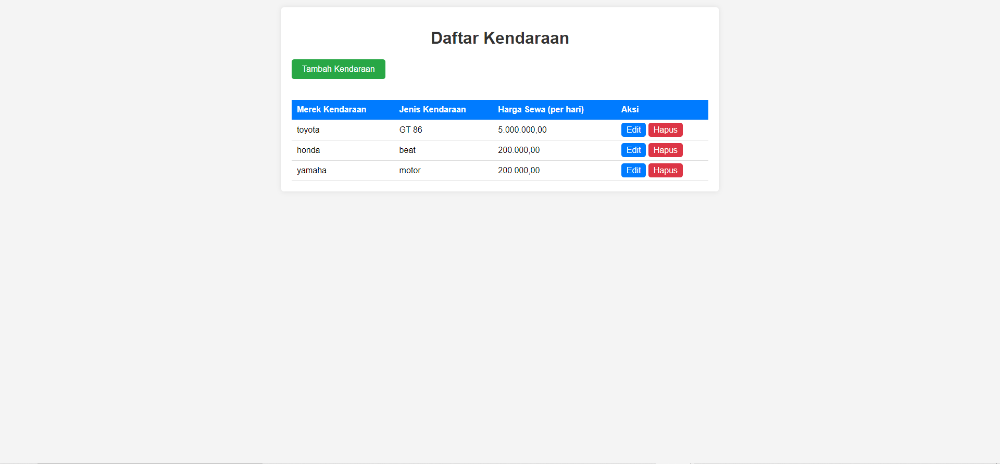

# Aplikasi Manajemen Rental Kendaraan

Aplikasi Manajemen Rental Kendaraan adalah sistem sederhana berbasis web yang memungkinkan pengguna untuk mengelola daftar kendaraan yang tersedia untuk disewa. Aplikasi ini dibangun menggunakan PHP dan SQLite.



## Fitur

- Menampilkan daftar kendaraan
- Menambahkan kendaraan baru
- Mengedit informasi kendaraan
- Menghapus kendaraan dari daftar

## Persyaratan Sistem

- PHP 7.0 atau lebih baru
- SQLite3
- Web server (misalnya Apache, Nginx)

## Instalasi

1. Clone repositori ini ke direktori web server Anda:
   ```
   git clone https://github.com/username/rental-kendaraan-app.git
   ```
2. Pastikan web server Anda memiliki izin untuk menulis ke direktori aplikasi (untuk database SQLite).
3. Buka aplikasi melalui web browser (misalnya: `http://localhost/rental-kendaraan-app`).

## Penggunaan

1. Halaman utama menampilkan daftar semua kendaraan yang tersedia.
2. Klik tombol "Tambah Kendaraan" untuk menambahkan kendaraan baru.
3. Untuk mengedit informasi kendaraan, klik tombol "Edit" di samping kendaraan yang ingin diubah.
4. Untuk menghapus kendaraan, klik tombol "Hapus" di samping kendaraan yang ingin dihapus.

## Struktur Proyek

```
rental-kendaraan-app/
│
├── index.php         # Halaman utama yang menampilkan daftar kendaraan
├── add.php           # Halaman untuk menambahkan kendaraan baru
├── edit.php          # Halaman untuk mengedit informasi kendaraan
├── delete.php        # Script untuk menghapus kendaraan
├── db.php            # Konfigurasi database dan fungsi-fungsi terkait
├── style.css         # File CSS untuk styling aplikasi
└── kendaraan.db      # Database SQLite (akan dibuat otomatis)
```


